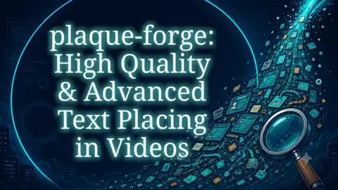
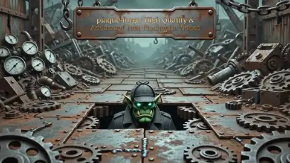
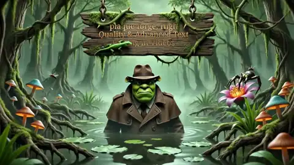

# Plaque Forge

[](https://github.com/zertyz/plaque-forge/actions/workflows/ci.yml)

Plaque Forge replaces or adds artistic title text on moving video surfaces while preserving camera/surface motion and objects that cross in front of the title.

A **writing surface** may be a rectangle, rounded plaque, circle/ellipse, polygon, irregular mask, or an injected transparent PNG. Plaque Forge does as much as it can automatically before asking for small human corrections.

Normal use is **setup once → analyze once → render many → review**.

## Sample output

Rendered with one command per style — golden shine for real plaques, classic glow for plaque-less and background scenes:

| | |
|---|---|
| [](https://github.com/zertyz/plaque-forge/releases/tag/sample_videos) | [](https://github.com/zertyz/plaque-forge/releases/tag/sample_videos) |
| [](https://github.com/zertyz/plaque-forge/releases/tag/sample_videos) | [](https://github.com/zertyz/plaque-forge/releases/tag/sample_videos) |

The [sample videos release](https://github.com/zertyz/plaque-forge/releases/tag/sample_videos) carries the full set — every bundled asset in both aspect families, plus browser-friendly MP4 previews — regenerated automatically by CI whenever a push to `main` may change rendered output. Each video there was machine-verified against its analysis cache before publication.

## 1. Install prerequisites

On CachyOS / Arch Linux:

```bash
sudo pacman -S --needed \
  rust clang opencv ffmpeg pkgconf fontconfig noto-fonts \
  python python-numpy python-pillow uv git

# `rust` is the system Rust package (ships cargo/rustfmt/clippy); do not mix with rustup.
```

Prepare the ML foreground/object worker once:

```bash
./scripts/setup_segmentation.sh
```

Everything Python/model-related lives under **`/tmp/plaque-forge-python`**, including its virtualenv, cloned ML repositories, and model caches. Nothing is installed into your user Python environment or user caches. If setup is interrupted after downloads, rerunning the same command first attempts an offline in-place repair rather than deleting the cache. Use `--verify` for an offline smoke test, or `--torch-profile cpu` when an XPU build is inappropriate (for example, hosted CI). If `/tmp` is cleared, rerun setup.

Plaque Forge requires Rust, FFmpeg/FFprobe, OpenCV, Clang, fontconfig, and the Noto fonts. Production rendering uses the font file selected by `--font` (or resolved by `--font-family` in the helper scripts); when neither is given, the helper scripts default to the repository-pinned `fonts/NotoSerif-Regular.ttf`, which deterministic text-mask tests and homologation also use. The optional worker uses a setup-managed Python 3.10 environment with exact package, source-commit, and model-revision identities.

> The authoritative, continuously-validated dependency set is the `code-gate` job in [`.github/workflows/ci.yml`](.github/workflows/ci.yml) (its install step). That workflow is the real source of truth; the command above is a convenience summary and may lag behind it.

## 2. Analyze once

```bash
./scripts/analyze_assets.sh
```

This is the high-level analysis command. It builds Plaque Forge, detects/selects the writing surface, tracks it, reconstructs the writable region, finds foreground crossings, and **automatically invokes the Python segmentation worker when ML can sharpen those foreground masks**. Existing human-declared ML prompts are also materialized automatically.

The bundled source surfaces are intentionally text-free. The high-level script makes that assertion explicitly. Direct CLI analysis must also include `--source-is-text-free`: Plaque Forge composites new typography, but does not remove or inpaint an existing title.

Analyze selected assets by appending their stems:

```bash
./scripts/analyze_assets.sh 16_9_dungeon_spider_iron_plaque 9_16_swamp_wooden_plaque
```

Use `--force` to rebuild current Rust/scene caches, `--force-ml` to regenerate ML work too, or `--no-ml` only when you explicitly want the pure-Rust path. In `--no-ml` mode, valid previously generated prompted layers may be reused, while missing/incompatible prompted layers are skipped rather than turning an explicitly pure-Rust run into a setup error. Run `./scripts/ml_status.sh` to see whether Python actually ran.

ML model choice is planned by Rust by default (`--backend auto`). The default profile is `canonical`: the normal quality path uses robust SAM2+Cutie, resolves `--precision auto` to FP32, and disables compilation-induced numeric variance. `preview` and `balanced` are explicit speed/iteration choices rather than implicit quality compromises. Device and numeric precision remain independent policies: `--device` selects execution hardware while `--precision` selects `fp32`/`bf16`. Opaque layers skip optical alpha refinement, while explicitly declared human optical mattes may select MatAnyone2. SAM 3.1 is an optional experimental CUDA backend installed separately with `./scripts/setup_sam31.sh`; it is never selected implicitly. See [Segmentation strategy](docs/SEGMENTATION.md).

When automatic quality is insufficient, the incomplete cache is deleted. Only compact diagnostics are retained under `/tmp/plaque-forge/failures/<asset>/`, limited to the newest three failures and seven days. Fix only the smallest item identified by `review.html`, then rerun analysis; a successful run removes retained failures for that asset.

### Plaque-less videos

The included plaque-less sample videos use the aspect-specific **Aetherglass Aurora** pair:

```text
assets/plaques/aetherglass-aurora-16_9.png
assets/plaques/aetherglass-aurora-9_16.png
```

An additional **Prismwraith Reliquary** pair is available for both aspect ratios. See `assets/plaques/catalog.toml` for dimensions, writable insets, and hashes. For another plaque-less asset:

```bash
./scripts/place_plaque.sh my-video assets/plaques/aetherglass-aurora-16_9.png
./scripts/analyze_assets.sh my-video
```

## 3. Render as many titles/styles as you want

```bash
./scripts/render_assets.sh \
  --text 'Nós que aqui estamos, por vós - ansiosamente - esperamos!' \
  --font-family 'Noto Serif' \
  --style gold-shine
```

Outputs go to `output/*.hevc.mkv`. Append asset stems to render only those videos. Each video, canonical text mask, render decision trace, optional contact sheet, and render manifest is published as a transactional bundle; an interrupted render cannot replace a previously complete bundle with partial files.

**Artistic line composition is the default**, using the largest safe title size. The default direct style also has a visible glow.

Try the bundled styles with `--style NAME`. In addition to the existing glow, metal, holographic, liquid, glitch, trail, ice, fire, nebula, halftone, typewriter, and dissolve presets, the renderer now includes `art-deco-arc`, `orbital-text`, `texture-mapped`, `scramble-reveal`, `split-flap`, `confetti-converge`, `laser-burn-wood`, `scene-emboss`, `blueprint`, and `paper-collage`.

See [Text effects](docs/TEXT_EFFECTS.md) for the exact capability matrix and style format.

## 4. Protect homologated outputs

Human-accepted outputs can carry executable regression contracts. Run the representative
visual integration gate with:

```bash
./scripts/check_homologated_assets.sh
```

The gate checks scene geometry, typography limits, exact render provenance, and sparse
reviewed foreground/source-preservation witnesses. `assets/homologation/capabilities.toml` records
coverage by behavioral capability rather than by filename; run `plaque-forge homologation-coverage`
to see which representative behaviors are still awaiting explicit human acceptance. Failed semantic
witnesses emit source/render/diff/overlay images under `output/regressions/`. See
[Homologation](docs/HOMOLOGATION.md). CI also protects the non-Rust setup and pure-Rust analysis paths. A trusted generated-analysis producer can refresh stale ML analysis on a bot branch and explicitly dispatch validation on that generated commit; see [Continuous integration](docs/CI.md) · [Segmentation strategy](docs/SEGMENTATION.md).

## 5. Review quality

Generate/rebuild the human quality reports after analysis/rendering:

```bash
./scripts/review_assets.sh
```

Open:

```text
output/review/index.html
```

Each asset report prioritizes what matters, shows the visual evidence, states whether Python ML participated, points to the exact scene file when one exists, and gives the commands to rerun. This is the preferred place for detailed quality/debug guidance.

## Start analysis completely fresh

To delete **all generated scene-analysis caches** and rebuild them:

```bash
./scripts/reset_analysis.sh --yes
./scripts/analyze_assets.sh
```

To also regenerate every Python ML layer while keeping the downloaded models/runtime:

```bash
./scripts/reset_analysis.sh --yes
./scripts/analyze_assets.sh --force-ml
```

This does not delete source videos, human/project scene intent, plaque PNGs, rendered output, or `/tmp/plaque-forge-python`. Small reviewed scene masks such as moss/shadow geometry are intentionally preserved.

To remove obsolete pre-0.8 partial directories and completed worker request files without touching complete caches:

```bash
./scripts/cleanup_work.sh --yes
```

Generated manifests use only portable relative paths. Incompatible caches are rejected and must be regenerated; they are never silently relabelled.

## 6. Interactive Showcase

Visual style selection with live preview:

```bash
cargo run --manifest-path plaque-forge-showcase/Cargo.toml
```

* `PgUp`/`PgDown` – cycle source videos (loops each)
* `Enter` – edit title text (`Press ENTER to change this text` by default)
* `/` – curated font picker (`↑`/`↓` live preview; type letters to search all system fonts; `Enter` confirm / `Esc` revert)
* `↑`/`↓` – cycle styles (`styles/*.toml`), discarding draft
* `i` – cycle inspect overlays (yellow plaque bounds, green foreground, blue writable, magenta structural, orange occluder)
* `Shift+I` – multi-overlay checklist; when no analysis, video is greyscale with “No analysis data for this video — Consult the documentation on how to generate it”
* `d` – demo: random curated fonts + styles per video, `Esc` exits
* Right panel “Style Lab” – full parametric editor (fill/material, layouts, underlays, overlays, surface, animations) with mouse + sliders + color pickers; `Save…` writes `styles/<name>_custom.toml`
* The preview renders at the source FPS (24/30) via cached typography + per-frame warp; the same `egui`/`eframe` code builds to `wasm` for a future web preview.

## Self-contained builds

Everything in this section is inert unless you opt in: `plaque-forge list` works from repository directories, and no media is compiled into the binary by default. With `--features bundle-media`, the source videos, analysis caches, scenes, styles, plaques, textures, and the curated fonts are linked into a single self-sufficient binary (system fonts stay external). See [Bundled media](docs/BUNDLING.md) for what is embedded, the curated font format, build cost, and limitations.

## Repository map

```text
src/                         Rust implementation (`application` is the programmatic API and service boundary)
scripts/                     high-level setup/analyze/render/review operations
tools/                       optional external-tool adapters
styles/                      reusable typography/material/effect programs + curated font list
assets/*.mp4                 source videos
assets/plaques/              reusable injected plaque images
assets/scenes/<name>/        sparse human intent + small reviewed source masks
assets/analysis/<name>/      generated, reproducible scene cache (never human intent)
assets/homologation/<name>/   reviewed regression contracts + sparse visual evidence
output/                      rendered videos and quality-report index
docs/                        architecture and advanced workflows (bundling: docs/BUNDLING.md)
```

The project, including its bundled assets, is MIT-licensed. More detail: [Glossary](docs/GLOSSARY.md) · [Architecture](docs/ARCHITECTURE.md) · [Scenes](docs/SCENES.md) · [Workflows](docs/WORKFLOWS.md) · [Validation](docs/VALIDATION.md) · [Homologation](docs/HOMOLOGATION.md) · [Performance](docs/PERFORMANCE.md) · [Security](docs/SECURITY.md) · [Safety](docs/SAFETY.md) · [Continuous integration](docs/CI.md) · [Segmentation strategy](docs/SEGMENTATION.md) · [Bundled media](docs/BUNDLING.md).
